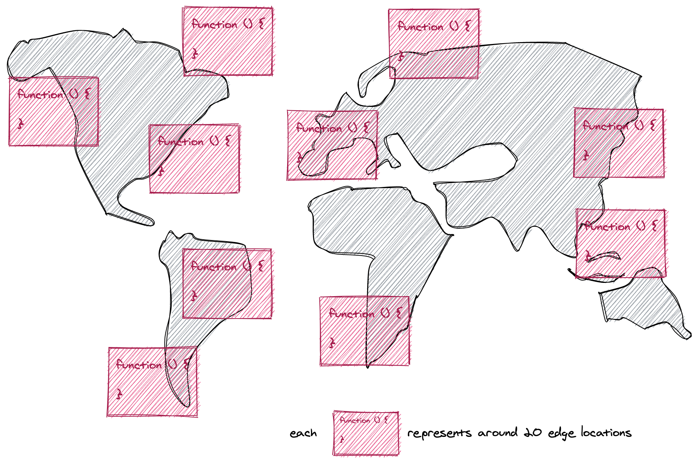

# [fit] Micro-frontends on the edge
### [fit] **una storia di persone, migrazioni e serverless**

 
 
 
 
 

### @**_maxgallo**

---

# Ciao, sono Max

### **🇮🇹 -> 🇬🇧**

Principal Engineer @ DAZN

  

### twitter: @**_maxgallo**
### web: **maxgallo.io**

---

[.column]
       
#[fit] Agenda

[.column]

  

## **Contesto**

## **Migrazione**

## **Lambda @ Edge**

## **Analisi Soluzione**

---
<!--
### 1. Contesto

1. DAZN Constraints
2. Soluzione

### 2. Migrazione

1. Due Frontend
2. Routing Missing Part

### 3. Lambda @ Edge
- Overview
- Challenges
	- Development
	- Concurrent Limit
	- Logs & Metrics Aggregation
		- Lambda logs & cloudfront logs
- Tips

### 4. Solution Analysis
- Costs
- Check Needs VS Caracteristic
- Canary Deployment
- Runtime configuration
	-  make network calls to resources in the same region where your Lambda@Edge function is executing to reduce network latency.

### 5. TakeAways

---
-->

#[fit] Contesto
## **Migrazione**
## **Lambda @ Edge**
## **Analisi Soluzione**

 
 

### @**_maxgallo**

---

# Spike di utenti

---

# Spike di utenti
# **-> Scalabilità**

---

# Team in Espansione

---

# Team in Espansione
# **-> Indipendenza**

---

# Eventi Live

---

# Eventi Live
# **-> Velocità**

---

[.column]

    

# **Spike di utenti**
# **Team in Espansione**
# **Eventi Live**

[.column]

        
# [fit] Contesto

---

# Santa Trinità di **AWS**

^ Scalabilità ✓
^ Indipendenza ✓
^ Velocità ✓

---

## **Contesto**

#[fit] Migrazione

## **Lambda @ Edge**
## **Analisi Soluzione**

 

### @**_maxgallo**

---

# Due Frontend, **Due Aziende**

---

^ Stesse funzionalità

---

# Micro-frontends

[.footer: Micro-frontends resources: [https://medium.com/@lucamezzalira/micro-frontends-resources-53b1ec7d512a](https://medium.com/@lucamezzalira/micro-frontends-resources-53b1ec7d512a)]

---

# Quale Frontend ?

---

# Caratteristiche

[.list: #000000, bullet-character(->), alignment(left)]
[.build-lists: true]

- __*Scalabile*__
- __*Veloce*__
- __*Stessa URL*__
- __*Indipendente dal Frontend*__
- __*Canary Deployment*__

---

## **Contesto**

## **Migrazione**

## [fit] Lambda @ Edge

## **Analisi Soluzione**

 

### @**_maxgallo**

---

# Lambda @ Edge

[.list: #000000, bullet-character(->), alignment(left)]

[.build-lists: true]
Come le AWS Lambda normali:

- __*Scalano automaticamente*__
- __*Paghi solo quando le usi*__
- __*Puoi configurare la memoria*__

 

E in particolare hanno

- __*Devono essere deployate in us-east-1*__
- __*Hanno dei limiti leggermente diversi*__
- ...

[.footer: [https://docs.aws.amazon.com/AmazonCloudFront/latest/DeveloperGuide/cloudfront-limits.html#limits-lambda-at-edge](https://docs.aws.amazon.com/AmazonCloudFront/latest/DeveloperGuide/cloudfront-limits.html#limits-lambda-at-edge)]

---
 
 
 
 

## Lambda @ Edge
### runnano su CloudFront

[.footer: 205 Edge Locations and 11 Regional Edge Caches]

---

# Lambda @ Edge

^ La riga tratteggiata è dove CloudFront cacha gli oggetti

---

# L@E Challenge #1

## **Concurrent Limit**

Limite di 1000 concurrent executions per ogni account, per region.

Esempio: *5000 RPS* * *6ms* execution time = *30* concurrent Lambda @ Edge

    

[.footer: È possibile estendere il limite fino a 5000 per account per region.]

---

# L@E Challenge #2

## **Development**

Il deploy delle Lambda@Edge nelle Edge Location può durare fino a 10 minuti.

       

     

^ AWS ha detto che stanno lavorando per ridurre il tempo.

---

# L@E Challenge #3

## **Metrics**
Disponibili nella regione dove la Lambda @ Edge ha runnato (11 AWS Regions).

Parzialmente aggregate nella console di CloudFront.

^ 11 AWS Region sono dove CloudFront ha un Regional Edge Cache

[.footer: https://aws.amazon.com/about-aws/whats-new/2019/06/announcing-enhanced-lambda-edge-monitoring-amazon-cloudfront-console/]

---

# L@E Challenge #4

## **Lambda Logs**

CloudWatch logs nella regione più vicina alla richiesta (11 AWS Regions).     

^ 11 AWS Region sono dove CloudFront ha un Regional Edge Cache

[.footer: [https://aws.amazon.com/blogs/networking-and-content-delivery/aggregating-lambdaedge-logs/](https://aws.amazon.com/blogs/networking-and-content-delivery/aggregating-lambdaedge-logs/)]

---

# L@E Challenge #5

## **Lambda Validation Logs**

CloudWatch logs sulla validazione degli output delle Lambda @ Edge.

Disponibili al log group:  __*/aws/cloudfront/LambdaEdge/DistributionId*__

[.footer: [https://docs.aws.amazon.com/AmazonCloudFront/latest/DeveloperGuide/lambda-edge-testing-debugging.html](https://docs.aws.amazon.com/AmazonCloudFront/latest/DeveloperGuide/lambda-edge-testing-debugging.html) ]
---

## **Contesto**

## **Migrazione**

## **Lambda @ Edge**

## [fit] Analisi Soluzione

 

### @**_maxgallo**

---

# Costi

Con circa __*2ms*__ di tempo di esecuzione

---

# Lambda @ Edge in DAZN

[.list: #000000, bullet-character(->), alignment(left)]
[.build-lists: true]

- *Scalabile*
- *Veloce*
- *Stessa URL*
- *Indipendente dal Frontend*
- **Canary Deployment**

---

# Canary Deployment

Logica per Canary release con geo-routing nella lambda.
Dove teniamo la configurazine ?

---

# External Configuration

- Sticky Session + Cookie

[.footer: https://aws.amazon.com/blogs/networking-and-content-delivery/leveraging-external-data-in-lambdaedge/ ]

---

# TakeAways

Lavorare on the edge è possibile (non solo AWS)

---

#[fit] Thank You

# [fit] **github.com/maxgallo/talk-micro-frontends-on-the-edge**

 
 
 

### @**_maxgallo**
